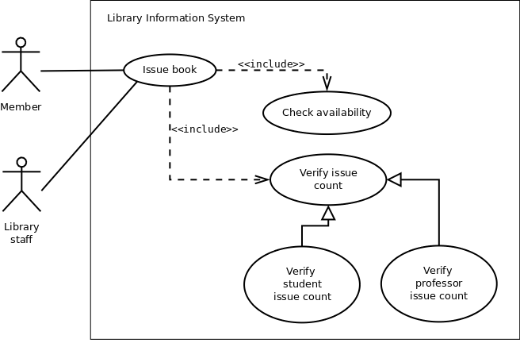

## Case Study

**1. A Library Information System for SE VLabs Institute**

The SE VLabs Institute has been recently setup to provide state-of-the-art research facilities in the field of Software Engineering. Apart from research scholars (students) and professors, it also includes quite a large number of employees who work on different projects undertaken by the institution.

As the size and capacity of the institute is increasing with the time, it has been proposed to develop a Library Information System (LIS) for the benefit of students and employees of the institute. LIS will enable the members to borrow a book (or return it) with ease while sitting at his desk/chamber. The system also enables a member to extend the date of his borrowing if no other booking for that particular book has been made. For the library staff, this system aids them to easily handle day-to-day book transactions. The librarian, who has administrative privileges and complete control over the system, can enter a new record into the system when a new book has been purchased, or remove a record in case any book is taken off the shelf. Any non-member is free to use this system to browse/search books online. However, issuing or returning books is restricted to valid users (members) of LIS only.

The final deliverable would a web application (using the recent HTML 5), which should run only within the institute LAN. Although this reduces security risk of the software to a large extent, care should be taken no confidential information (eg., passwords) is stored in plain text.

From the given problem statement we can identify a list of actors and use cases as shown in tables 1 & 2 respectively. We assign an identifier to each use case, which we would be using to map from the software requirements identified earlier.

Table 1: List of actors

Actor | Description 
:--|:--|
Member | Can avail LIS facilities; could be student, professor, researcher| 
Non-member | Need to register to avail LIS facilities | 
Librarian | Update inventory and other administrative tasks | 
Library staff	 | Handle day-to-day activities with the LIS|
  

Table 2: List of use cases

#| Use Case| Description 
:--|:--|:--|
UC1|Register| Allows to register with the LIS and create an account for all transactions| 
UC2|User login | LIS authenticates a member to let him avail the facilities| 
UC3|Search book| A member can can search for a book | 
UC4|Issue book | Allows a member to issue a specified book against his account
  | 
UC5|Return book|To return a book, which has been issued earlier by a member|
UC6|Reissue book|To reissue a book|
UC7|User logout	|User logs out from the system|

Before presenting the details of individual use cases, let us do a mapping from requirements specifications to use cases. A list of functional requirements can be found in the table 1. For each such requirements, we identify the use case(s) that helps to achieve the requirement. This mapping is shown in table 3. Please note that we would be mapping only functional requirements into use cases. A method to deal with non-functional requirements could be found in [6].

Table 3: List of use cases

FR#| FR Description| Use Case(s) 
:--|:--|:--|
R1|New user registration| UC1| 
R2|User login | UC2| 
R3|Search book| UC3 | 
R4|Issue book | UC4
  | 
R5|Return book|UC5|
R6|Reissue book|UC6|

Now let us deal with the inner details of a few use cases and the actors with whom they are associated. Table 4 shows the details of the "User login" use case using a template presented in table 1 in [5].

Table 4:UC2 -- User login

Use Case| UC2. User Login
:--|:--|
Description|Allows a member to login to the system using his user ID and password 
Assumptions|
Actors|Member 
Steps|1. User types in user ID  2. User types in password, 3. User clicks on the 'Login' button, 4. IF successful THEN show home page, ELSE display error| 
Variations|
Non-functional|
Issues|

The above use case lets an already registered member of the LIS to login to the system and possible use it's various features. If the user provides a correct pair of (<user_id>, <password>) then he can access his home page. However, if login credentials are incorrect, an error message is displayed to him. Figure 1 shows its pictorial representation.

Figure 1: Use case diagram showing "New user registration" use case

 The above figure also depicts extension of a use case. "Answer security question" is not a use case by itself, and is not invoked in a "normal" flow. However, when a member is trying to login, and provides incorrect (<user_id>, <password>) for three consecutive times, he is asked the security question that was set during registration. If user can answer the question correctly, the password is send to his email address. However, if the user fails to answer the security question correctly, his account is temporarily blocked. Details of the concerned use case extension is shown in table 5.

 Table 5: Extension for use case New user registration

Use Case Extension| Answer security question extends UC2. User login
:--|:--|
Description|Deals with the condition when a user has three consecutive login failures, and he attempts to login again 
Steps|3a. IF consecutive failure count is 3 THEN invoke "Answer security question"

The details of the "Issue book" use case is shown in table 6.

Table 6: UC5 -- Issue book

Use Case|UC5. Issue book
:--|:--|
Description|Allows a member to issue a specified book against his account 
Assumptions| 1. User is logged in. 2. The book is available 3. User's account has not exceeded the limit of maximum books that can be issued 
Actors|Member (primary), Library staff 
Steps| 1. User logs in, 2. User searches for a book, 3. User clicks on "Issue" button to issue the book, 4. User's account is updated, 5.Library staff delivers the book |
Variations| 
Non-functional| 
Issues| 

In order to issue a book, the availability of the book has to be checked. Also, the system needs to verify whether another book could be issued to the current user. These are shown in figure 2 by the «include» relationship among the use cases. The maximum # of books that can be issued to a user depends on whether he is a student or a professor. So, "Verify issue count" is a general use case, which has been specialized by "Verify student issue count" and "Verify professor issue count" use cases. These have been represented by the "generalization" relationship in figure 2.

Figure 2: Use case diagram showing "Issue book" use case

In the above scenario "Member" is the primary actor who triggers the "Issue book" use case. "Library staff" is a secondary actor here.