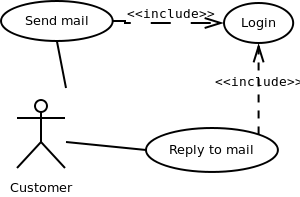
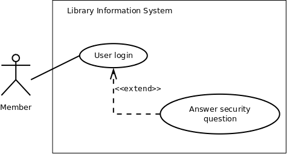

## Introduction 

Use case diagram is a platform that can provide a common understanding for the end-users, developers and the domain experts. It is used to capture the basic functionality i.e. use cases, and the users of those available functionality, i.e. actors, from a given problem statement.

In this experiment, we will learn how use cases and actors can be captured and how different use cases are related in a system.

 

## Theory

### Use case diagrams
Use case diagrams belong to the category of behavioural diagram of UML diagrams. Use case diagrams aim to present a graphical overview of the functionality provided by the system. It consists of a set of actions (referred to as use cases) that the concerned system can perform, one or more actors, and dependencies among them.

#### Actor

An actor can be defined as an object or set of objects, external to the system, which interacts with the system to get some meaningful work done. Actors could be human, devices, or even other systems.

For example, consider the case where a customer withdraws cash from an ATM. Here, customer is a human actor.

Actors can be classified as below, [1] :

- **Primary actor:** They are principal users of the system, who fulfill their goal by availing some service from the system. For example, a customer uses an ATM to withdraw cash when he needs it. A customer is the primary actor here.
- **Supporting actor:** They render some kind of service to the system. "Bank representatives", who replenishes the stock of cash, is such an example. It may be noted that replenishing stock of cash in an ATM is not the prime functionality of an ATM.
In a use case diagram primary actors are usually drawn on the top left side of the diagram.

#### Use Case
A use case is simply a functionality provided by a system.

Continuing with the example of the ATM, withdraw cash is a functionality that the ATM provides. Therefore, this is a use case. Other possible use cases includes, check balance, change PIN, and so on.

Use cases include both successful and unsuccessful scenarios of user interactions with the system. For example, authentication of a customer by the ATM would fail if he enters wrong PIN. In such case, an error message is displayed on the screen of the ATM.

#### Subject

Subject is simply [3] the system under consideration. Use cases apply to a subject. For example, an ATM is a subject, having multiple use cases, and multiple actors interact with it. However, one should be careful of external systems interacting with the subject as actors.

### Graphical Representation
An actor is represented by a stick figure and name of the actor is written below it. A use case is depicted by an ellipse and name of the use case is written inside it. The subject is shown by drawing a rectangle. Label for the system could be put inside it. Use cases are drawn inside the rectangle, and actors are drawn outside the rectangle, as shown in figure - 01.

Figure - 01: A use case diagram for a book store

### Association between Actors and Use Cases
A use case is triggered by an actor. Actors and use cases are connected through binary associations indicating that the two communicates through message passing.

An actor must be associated with at least one use case. Similarly, a given use case must be associated with at least one actor. Association among the actors are usually not shown. However, one can depict the class hierarchy among actors.

### Use Case Relationships
Three types of relationships exist among use cases:

- Include relationship
- Extend relationship
- Use case generalization

### Using Subclasses
Here, instead of identifying objects one goes for identification of classes based on some similar characteristics. These are the specialized classes. Common characteristics are taken from them to form the higher level generalized classes.

#### Include Relationship
Include relationships are used to depict common behaviour that are shared by multiple use cases. This could be considered analogous to writing functions in a program in order to avoid repetition of writing the same code. Such a function would be called from different points within the program.

##### Example
For example, consider an email application. A user can send a new mail, reply to an email he has received, or forward an email. However, in each of these three cases, the user must be logged in to perform those actions. Thus, we could have a login use case, which is included by compose mail, reply, and forward email use cases. The relationship is shown in figure 02.

Figure - 02: Include relationship between use cases

##### Notation

Include relationship is depicted by a dashed arrow with a «include» stereotype from the including use case to the included use case.

#### Extend Relationship
Use case extensions are used used to depict any variation to an existing use case. They are used to the specify the changes required when any assumption made by the existing use case becomes false [4, 5].

##### Example
Let's consider an online bookstore. The system allows an authenticated user to buy selected book(s). While the order is being placed, the system also allows to specify any special shipping instructions [8], for example, call the customer before delivery. This Shipping Instructions step is optional, and not a part of the main Place Order use case. Figure - 03 depicts such relationship.

Figure - 03: Extend relationship between use cases

##### Notation
Extend relationship is depicted by a dashed arrow with a «extend» stereotype from the extending use case to the extended use case.

#### Generalization Relationship
Generalization relationship are used to represent the inheritance between use cases. A derived use case specializes some functionality it has already inherited from the base use case.

##### Example
To illustrate this, consider a graphical application that allows users to draw polygons. We could have a use case draw polygon. Now, rectangle is a particular instance of polygon having four sides at right angles to each other. So, the use case draw rectangle inherits the properties of the use case draw polygon and overrides it's drawing method. This is an example of generalization relationship. Similarly, a generalization relationship exists between draw rectangle and draw square use cases. The relationship has been illustrated in figure - 04.

Figure - 04: Generalization relationship among use cases

##### Notation
Generalization relationship is depicted by a solid arrow from the specialized (derived) use case to the more generalized (base) use case.

### Identifying Actors
Given a problem statement, the actors could be identified by asking the following questions:

- Who gets most of the benefits from the system? (The answer would lead to the identification of the primary actor)
- Who keeps the system working? (This will help to identify a list of potential users)
- What other software / hardware does the system interact with?
- Any interface (interaction) between the concerned system and any other system?

### Identifying Use cases
Once the primary and secondary actors have been identified, we have to find out their goals i.e. what are the functionality they can obtain from the system. Any use case name should start with a verb like, "Check balance".

## Guidelines for drawing Use Case diagrams
Following general guidelines could be kept in mind while trying to draw a use case diagram:

- Determine the system boundary
- Ensure that individual actors have well-defined purpose
- Use cases identified should let some meaningful work done by the actors
- Associate the actors and use cases -- there shouldn't be any actor or use case floating without any connection
- Use include relationship to encapsulate common behaviour among use cases , if any

Also look at [9] for further tips.

## Case Study

1. A Library Information System for SE VLabs Institute
The SE VLabs Institute has been recently setup to provide state-of-the-art research facilities in the field of Software Engineering. Apart from research scholars (students) and professors, it also includes quite a large number of employees who work on different projects undertaken by the institution.

As the size and capacity of the institute is increasing with the time, it has been proposed to develop a Library Information System (LIS) for the benefit of students and employees of the institute. LIS will enable the members to borrow a book (or return it) with ease while sitting at his desk/chamber. The system also enables a member to extend the date of his borrowing if no other booking for that particular book has been made. For the library staff, this system aids them to easily handle day-to-day book transactions. The librarian, who has administrative privileges and complete control over the system, can enter a new record into the system when a new book has been purchased, or remove a record in case any book is taken off the shelf. Any non-member is free to use this system to browse/search books online. However, issuing or returning books is restricted to valid users (members) of LIS only.

The final deliverable would a web application (using the recent HTML 5), which should run only within the institute LAN. Although this reduces security risk of the software to a large extent, care should be taken no confidential information (eg., passwords) is stored in plain text.

From the given problem statement we can identify a list of actors and use cases as shown in tables 1 & 2 respectively. We assign an identifier to each use case, which we would be using to map from the software requirements identified earlier.

Table 1: List of actors

Actor | Description 
:--|:--|
Member | Can avail LIS facilities; could be student, professor, researcher| 
Non-member | Need to register to avail LIS facilities | 
Librarian | Update inventory and other administrative tasks | 
Library staff	 | Handle day-to-day activities with the LIS|
  

Table 2: List of use cases

#| Use Case| Description 
:--|:--|:--|
UC1|Register| Allows to register with the LIS and create an account for all transactions| 
UC2|User login | LIS authenticates a member to let him avail the facilities| 
UC3|Search book| A member can can search for a book | 
UC4|Issue book | Allows a member to issue a specified book against his account
  | 
UC5|Return book|To return a book, which has been issued earlier by a member|
UC6|Reissue book|To reissue a book|
UC7|User logout	|User logs out from the system|

Before presenting the details of individual use cases, let us do a mapping from requirements specifications to use cases. A list of functional requirements can be found in the table 1. For each such requirements, we identify the use case(s) that helps to achieve the requirement. This mapping is shown in table 3. Please note that we would be mapping only functional requirements into use cases. A method to deal with non-functional requirements could be found in [6].

Table 3: List of use cases

FR#| FR Description| Use Case(s) 
:--|:--|:--|
R1|New user registration| UC1| 
R2|User login | UC2| 
R3|Search book| UC3 | 
R4|Issue book | UC4
  | 
R5|Return book|UC5|
R6|Reissue book|UC6|

Now let us deal with the inner details of a few use cases and the actors with whom they are associated. Table 4 shows the details of the "User login" use case using a template presented in table 1 in [5].

Table 4:UC2 -- User login

Use Case| UC2. User Login
:--|:--|
Description|Allows a member to login to the system using his user ID and password 
Assumptions|
Actors|Member 
Steps|1. User types in user ID  2. User types in password, 3. User clicks on the 'Login' button, 4. IF successful THEN show home page, ELSE display error| 
Variations|
Non-functiona|
Issues|

The above use case lets an already registered member of the LIS to login to the system and possible use it's various features. If the user provides a correct pair of (<user_id>, <password>) then he can access his home page. However, if login credentials are incorrect, an error message is displayed to him. Figure 1 shows its pictorial representation.

Figure 1: Use case diagram showing "New user registration" use case

 The above figure also depicts extension of a use case. "Answer security question" is not a use case by itself, and is not invoked in a "normal" flow. However, when a member is trying to login, and provides incorrect (<user_id>, <password>) for three consecutive times, he is asked the security question that was set during registration. If user can answer the question correctly, the password is send to his email address. However, if the user fails to answer the security question correctly, his account is temporarily blocked. Details of the concerned use case extension is shown in table 5.

 Table 5: Extension for use case New user registration

Use Case Extension| Answer security question extends UC2. User login
:--|:--|
Description|Deals with the condition when a user has three consecutive login failures, and he attempts to login again 
Steps|3a. IF consecutive failure count is 3 THEN invoke "Answer security question"

The details of the "Issue book" use case is shown in table 6.

Table 6: UC5 -- Issue book
Use Case|UC5. Issue book
:--|:--|
Description|Allows a member to issue a specified book against his account
Assumptions| 1. User is logged in. 2. The book is available 3. User's account has not exceeded the limit of maximum books that can be issued
Actors|Member (primary), Library staff
Steps| 1. User logs in, 2. User searches for a book, 3. User clicks on "Issue" button to issue the book, 4. User's account is updated, 5.Library staff delivers the book
Variations|
Non-functiona|
Issues|

In order to issue a book, the availability of the book has to be checked. Also, the system needs to verify whether another book could be issued to the current user. These are shown in figure 2 by the «include» relationship among the use cases. The maximum # of books that can be issued to a user depends on whether he is a student or a professor. So, "Verify issue count" is a general use case, which has been specialized by "Verify student issue count" and "Verify professor issue count" use cases. These have been represented by the "generalization" relationship in figure 2.

Figure 2: Use case diagram showing "Issue book" use case

In the above scenario "Member" is the primary actor who triggers the "Issue book" use case. "Library staff" is a secondary actor here.