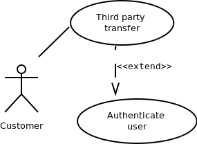
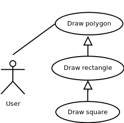

## Objectives

**After completing this experiment you will be able to:**

- Identify different actors and use cases from a given problem statement
- Associate use cases with different types of relationships
- Draw a use-case diagram
 

## Theory

### Use case diagrams
Use case diagrams belong to the category of behavioural diagram of UML diagrams. Use case diagrams aim to present a graphical overview of the functionality provided by the system. It consists of a set of actions (referred to as use cases) that the concerned system can perform, one or more actors, and dependencies among them.

#### Actor

An actor can be defined as an object or set of objects, external to the system, which interacts with the system to get some meaningful work done. Actors could be human, devices, or even other systems.

For example, consider the case where a customer withdraws cash from an ATM. Here, customer is a human actor.

Actors can be classified as below, [1] :

- **Primary actor:** They are principal users of the system, who fulfill their goal by availing some service from the system. For example, a customer uses an ATM to withdraw cash when he needs it. A customer is the primary actor here.
- **Supporting actor:** They render some kind of service to the system. "Bank representatives", who replenishes the stock of cash, is such an example. It may be noted that replenishing stock of cash in an ATM is not the prime functionality of an ATM.
In a use case diagram primary actors are usually drawn on the top left side of the diagram.

#### Use Case
A use case is simply a functionality provided by a system.

Continuing with the example of the ATM, withdraw cash is a functionality that the ATM provides. Therefore, this is a use case. Other possible use cases includes, check balance, change PIN, and so on.

Use cases include both successful and unsuccessful scenarios of user interactions with the system. For example, authentication of a customer by the ATM would fail if he enters wrong PIN. In such case, an error message is displayed on the screen of the ATM.

#### Subject

Subject is simply [3] the system under consideration. Use cases apply to a subject. For example, an ATM is a subject, having multiple use cases, and multiple actors interact with it. However, one should be careful of external systems interacting with the subject as actors.

### Graphical Representation
An actor is represented by a stick figure and name of the actor is written below it. A use case is depicted by an ellipse and name of the use case is written inside it. The subject is shown by drawing a rectangle. Label for the system could be put inside it. Use cases are drawn inside the rectangle, and actors are drawn outside the rectangle, as shown in figure - 01.

Figure - 01: A use case diagram for a book store

### Association between Actors and Use Cases
A use case is triggered by an actor. Actors and use cases are connected through binary associations indicating that the two communicates through message passing.

An actor must be associated with at least one use case. Similarly, a given use case must be associated with at least one actor. Association among the actors are usually not shown. However, one can depict the class hierarchy among actors.

### Use Case Relationships
Three types of relationships exist among use cases:

- Include relationship
- Extend relationship
- Use case generalization

### Using Subclasses
Here, instead of identifying objects one goes for identification of classes based on some similar characteristics. These are the specialized classes. Common characteristics are taken from them to form the higher level generalized classes.

#### Include Relationship
Include relationships are used to depict common behaviour that are shared by multiple use cases. This could be considered analogous to writing functions in a program in order to avoid repetition of writing the same code. Such a function would be called from different points within the program.

##### Example
For example, consider an email application. A user can send a new mail, reply to an email he has received, or forward an email. However, in each of these three cases, the user must be logged in to perform those actions. Thus, we could have a login use case, which is included by compose mail, reply, and forward email use cases. The relationship is shown in figure 02.

Figure - 02: Include relationship between use cases

##### Notation

Include relationship is depicted by a dashed arrow with a «include» stereotype from the including use case to the included use case.

#### Extend Relationship
Use case extensions are used to depict any variation to an existing use case. They are used to the specify the changes required when any assumption made by the existing use case becomes false [4, 5].

##### Example
Let's consider an online bookstore. The system allows an authenticated user to buy selected book(s). While the order is being placed, the system also allows to specify any special shipping instructions [8], for example, call the customer before delivery. This Shipping Instructions step is optional, and not a part of the main Place Order use case. Figure - 03 depicts such relationship.

Figure - 03: Extend relationship between use cases

##### Notation
Extend relationship is depicted by a dashed arrow with a «extend» stereotype from the extending use case to the extended use case.

#### Generalization Relationship
Generalization relationship are used to represent the inheritance between use cases. A derived use case specializes some functionality it has already inherited from the base use case.

##### Example
To illustrate this, consider a graphical application that allows users to draw polygons. We could have a use case draw polygon. Now, rectangle is a particular instance of polygon having four sides at right angles to each other. So, the use case draw rectangle inherits the properties of the use case draw polygon and overrides it's drawing method. This is an example of generalization relationship. Similarly, a generalization relationship exists between draw rectangle and draw square use cases. The relationship has been illustrated in figure - 04.

Figure - 04: Generalization relationship among use cases

##### Notation
Generalization relationship is depicted by a solid arrow from the specialized (derived) use case to the more generalized (base) use case.

### Identifying Actors
Given a problem statement, the actors could be identified by asking the following questions:

- Who gets most of the benefits from the system? (The answer would lead to the identification of the primary actor)
- Who keeps the system working? (This will help to identify a list of potential users)
- What other software / hardware does the system interact with?
- Any interface (interaction) between the concerned system and any other system?

### Identifying Use cases
Once the primary and secondary actors have been identified, we have to find out their goals i.e. what are the functionality they can obtain from the system. Any use case name should start with a verb like, "Check balance".

## Guidelines for drawing Use Case diagrams
Following general guidelines could be kept in mind while trying to draw a use case diagram:

- Determine the system boundary
- Ensure that individual actors have well-defined purpose
- Use cases identified should let some meaningful work done by the actors
- Associate the actors and use cases -- there shouldn't be any actor or use case floating without any connection
- Use include relationship to encapsulate common behaviour among use cases , if any

Also look at [9] for further tips.

